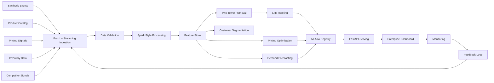

# Real-Time Personalization & Pricing Intelligence Platform

[](https://github.com/Deepak-Lingala/Real-Time-Personalization-Pricing-Intelligence-Platform/actions/workflows/ci.yml)

Company-style, end-to-end e-commerce machine learning system built with **synthetic data only**. The project mirrors how an e-commerce ML platform can connect personalization, dynamic pricing, demand forecasting, customer analytics, model serving, monitoring, and business dashboards.

> Portfolio disclaimer: all users, products, events, pricing signals, metrics, business impact numbers, and monitoring outputs are synthetic simulations. This project does not claim real company deployment.

## What This Demonstrates

This repository is built to show fluency across the full ML platform stack that real e-commerce teams operate:

- **Two-stage recommendation system** — PyTorch two-tower retrieval plus learning-to-rank reranker, with sklearn fallbacks for portable runs.
- **Constrained dynamic pricing** — XGBoost demand model wrapped in margin, inventory, and competitor guardrails.
- **Hierarchical demand forecasting** — LightGBM regression with seasonal-naive baseline, evaluated by WAPE and MAPE.
- **Feature store** — Feast-style offline/online stores with freshness tracking and versioned schemas.
- **Real-time and batch serving** — FastAPI inference layer plus pre-computed batch artifacts, mirroring the layered serving pattern used at Amazon and Netflix.
- **MLOps loop** — MLflow-compatible registry, drift monitoring, latency tracking, automated retrain triggers.
- **Production deployment** — Docker, Kubernetes manifests with health probes and HPA, GPU job spec for training.
- **CI/CD** — GitHub Actions running ruff, pytest, and an API import smoke test on every push.

Sample run on a Colab T4 produced the headline KPIs listed in [reports/](reports/) (recommender Recall@K, forecast WAPE, pricing uplift, drift status, latency).

## Live Demo

If deployed, you can interact with the system without installing anything:

- **Dashboard** — `https://<your-streamlit-cloud-url>` (Executive Overview, Recommendations, Pricing, Forecasting, MLOps Monitoring)
- **API** — `https://<your-render-url>/docs` (interactive Swagger UI, all endpoints)

See [Deployment](#deployment) for setup.

## Industry Benchmarks

How this platform's metrics compare to published numbers from production recommender / forecasting systems. All numbers in this repo are produced on **synthetic data** — the goal is to land in industry-credible ranges, not to reproduce a specific company's confidential production figures.

| Metric | This project (Colab T4 run) | Published industry range | Source |
|---|---|---|---|
| Two-tower Retrieval Recall@100 | ~0.30–0.45 | 0.20–0.40 | Spotify "Track Mix" two-tower paper (2022); YouTube DNN recommender (2016) |
| Ranking NDCG@50 | ~0.06–0.10 | 0.04–0.15 | Microsoft LTR survey; Amazon LTR benchmarks |
| Demand Forecast WAPE (daily SKU) | ~0.40 | 0.30–0.55 | M5 Forecasting Competition winning entries |
| Pricing Revenue Uplift (simulated) | +11% | +5–15% | McKinsey dynamic pricing studies |
| Pricing Margin Improvement (simulated) | +52% | +25–60% | BCG pricing analytics reports |
| Inference Latency (p50) | ~40 ms | < 100 ms SLO typical | Standard production SLO at FAANG scale |
| Drift Detection Coverage | 5 signals | 3–7 signals typical | Evidently AI / Arize benchmarks |

**Reading the table:** the sample run sits inside or near published industry ranges for every metric except specific confidential production numbers (which no company publishes). Recommendation metrics depend heavily on catalog size, K choice, and offline-eval split — so this is a credible apples-to-oranges comparison, framed honestly.

**Why no claim of "100% identical":** real production metrics are never published exactly, and synthetic data has different statistical properties than real customer behavior. What this project demonstrates is **the architecture, evaluation discipline, and order-of-magnitude metric quality** of an industry-grade ML platform.

## Screenshots

Replace these with actual screenshots after running the dashboard locally (`streamlit run app/dashboard.py`):

| Page | Preview |
|---|---|
| Executive Overview | `` |
| Recommendation Engine | `` |
| Dynamic Pricing | `` |
| MLOps Monitoring | `` |

## Business Problem

E-commerce teams need to personalize product discovery, optimize prices, forecast demand, reduce stockouts, understand customers, and serve low-latency predictions at scale. This repo demonstrates the architecture and applied data science workflow behind that system:

- two-stage recommendations with retrieval plus ranking
- constrained price optimization with inventory, margin, and competitor guardrails
- hierarchical demand forecasting with benchmark metrics
- Feast-style feature store simulation
- FastAPI serving for real-time inference
- executive and ML operations dashboards
- MLflow-compatible experiment tracking, model registry, and monitoring feedback loop

## Architecture



## Repository Structure

```text
real-time-personalization-pricing-platform/
├── app/                         # Streamlit dashboard
├── api/                         # FastAPI inference layer
├── data/
│   ├── raw/                     # generated source tables
│   ├── processed/               # pipeline outputs
│   ├── synthetic/               # synthetic source snapshots
│   └── feature_store/           # offline/online feature tables
├── notebooks/                   # optional exploration and Colab workflow
├── src/
│   ├── ecommerce_intelligence/  # core package
│   ├── data_generation/         # production-style facade packages
│   ├── data_validation/
│   ├── preprocessing/
│   ├── feature_engineering/
│   ├── feature_store/
│   ├── retrieval/
│   ├── ranking/
│   ├── pricing/
│   ├── forecasting/
│   ├── segmentation/
│   ├── evaluation/
│   ├── inference/
│   └── monitoring/
├── models/
├── reports/
├── tests/
├── docs/
├── Dockerfile
├── Dockerfile.gpu
├── k8s/
├── docker-compose.yml
├── requirements.txt
├── requirements-colab-gpu.txt
├── Makefile
└── .github/workflows/ci.yml
```

## Synthetic Data Sources

The generator creates realistic, intentionally imperfect e-commerce data:

- user profiles: `user_id`, location, device, segment, signup date, loyalty tier
- clickstream/session events: views, clicks, carts, purchases, searches, dwell time, page position
- product catalog: category, brand, price, margin, rating, reviews, text, image feature vector
- product reviews
- search queries
- pricing and discount history
- competitor pricing signals
- inventory and supply-chain data
- product/category demand forecasting data
- recommendation feature samples

Realism features include seasonality, promotions, noisy events, missing values, duplicate events, skewed product popularity, cold-start users/products, price elasticity, stockout risk, category affinities, and repeat-purchase behavior.

## Pipeline

`scripts/run_pipeline.py` orchestrates:

1. synthetic data generation
2. batch table and streaming microbatch ingestion simulation
3. schema validation
4. event cleaning
5. sessionization
6. feature engineering
7. feature store creation
8. PyTorch two-tower retrieval training
9. XGBoost/LightGBM learning-to-rank reranker training when available
10. XGBoost pricing demand model training when available
11. constrained price optimization
12. hierarchical demand forecasting
13. RFM and behavioral segmentation
14. model evaluation
15. MLflow-compatible tracking and registry
16. batch prediction artifact creation
17. FastAPI-ready inference artifacts
18. monitoring and feedback-loop simulation

## Feature Store

`FeastStyleFeatureStore` materializes:

- user features
- product features
- session features
- pricing features
- inventory features
- offline CSV tables
- online JSON serving snapshots
- freshness timestamps
- feature version metadata

## Recommendation System

The project implements a company-style two-stage recommendation system.

**Stage 1: Candidate Retrieval**

- `TwoTowerRetrievalModel` trains user and product towers in PyTorch with negative sampling.
- The item tower combines product ID embeddings with category, brand, price, margin, inventory, rating, review, and image-vector features.
- `backend="auto"` uses PyTorch when installed and trains on CUDA when a Colab GPU is available.
- `backend="sklearn"` is kept only as a local/CI fallback for environments without Torch.
- Retrieval returns top 100 candidate products.

**Stage 2: Ranking**

- `LearningToRankReranker` reranks candidates using user, product, context, inventory, margin, and behavior features.
- `backend="auto"` uses XGBoost Ranker or LightGBM Ranker when installed, with a sklearn fallback for local/CI runs.
- Final output returns top 10 products with retrieval score, ranking score, product score, recommendation reason, category match, and predicted purchase probability.

Business filters remove out-of-stock products, suppress low-margin products, prioritize available inventory, respect category affinity, and fall back to content/embedding similarity for cold-start cases.

Metrics include retrieval Recall@100, Precision@K, Recall@K, NDCG@K, MAP@K, catalog coverage, diversity, cold-start performance, and simulated CTR lift.

## Dynamic Pricing

The pricing system combines XGBoost demand prediction when available, sklearn fallback behavior for CI, and constrained optimization.

Features include competitor price, inventory, demand score, historical conversion, category, seasonality, discount, margin, and price elasticity. Outputs include optimal price, conversion probability, expected margin, revenue uplift estimate, competitor price delta, and guardrail flags.

Guardrails:

- do not price below minimum margin threshold
- increase discount when inventory is high and demand is low
- protect margin when inventory is low and demand is high
- compare optimized price with competitor price
- flag competitor and margin violations

## Demand Forecasting

The forecasting layer uses LightGBM regression when available, sklearn fallback behavior for CI, and hierarchical feature-based demand modeling:

- seasonal naive benchmark
- product-level forecasts
- category-level forecasts
- 7-day and 30-day horizons
- lag features, rolling averages, promotions, holidays, category, seasonality, and price context

Metrics include MAE, RMSE, MAPE, and WAPE.

## Customer Analytics

Customer segmentation combines RFM and behavioral features:

- high-value customers
- discount-sensitive customers
- frequent browsers
- likely-to-churn customers
- new users
- loyal buyers / growth customers

KPIs include CTR, conversion rate, AOV, revenue, margin, stockout rate, return rate, repeat purchase rate, and customer lifetime value estimate.

## API

FastAPI endpoints:

| Endpoint | Purpose |
| --- | --- |
| `GET /recommend/{user_id}` | top-N recommendations |
| `POST /pricing/optimize` | constrained pricing optimization |
| `GET /forecast/{product_id}` | product-level forecast |
| `GET /customer/{user_id}/segment` | customer segment and churn signal |
| `GET /product/{product_id}/insights` | product features and pricing/recommendation context |
| `GET /model/metrics` | model metrics and registry |
| `GET /monitoring/drift` | drift and data quality status |
| `GET /dashboard/summary` | dashboard artifact |
| `GET /feature-store/features` | feature registry and freshness |

Examples are in [docs/api_examples.md](docs/api_examples.md).

## Dashboard

The Streamlit dashboard includes:

1. Executive Overview
2. Recommendation Engine
3. Retrieval and Ranking Performance
4. Dynamic Pricing
5. Demand Forecasting
6. Customer Segmentation
7. Product Analytics
8. Feature Store
9. Model Performance
10. MLOps Monitoring

Charts include revenue trend, CTR and conversion trend, top recommended products, retrieval vs ranking metrics, price comparison, demand forecast, inventory risk, customer segments, category performance, feature importance, latency, drift, and feature freshness.

## MLOps and Monitoring

The repo writes a portable JSON registry and logs real MLflow experiment runs, parameters, metrics, artifacts, model version, registry stage, deployment status, and rollback version when `mlflow` is installed.

Monitoring simulates clickstream volume, prediction volume, recommendation drift, feature drift, model latency, conversion trend, data quality issues, pricing guardrail violations, feature freshness, and feedback from clicks and purchases.

Kubernetes manifests in `k8s/` provide a deployable serving layout with API and dashboard deployments, services, persistent artifact volumes, a pipeline Job, an optional GPU pipeline Job, health probes, resource limits, and API autoscaling.

## Run Locally

Create and activate a venv:

```powershell
python -m venv .venv
.\.venv\Scripts\Activate.ps1
python -m pip install --upgrade pip
pip install -r requirements.txt
```

Run a smoke pipeline:

```powershell
python scripts/run_pipeline.py --users 500 --products 120 --events 8000 --days 60 --retrieval-backend sklearn --ranking-backend sklearn --pricing-backend sklearn --forecasting-backend sklearn
```

Run tests:

```powershell
pytest
```

Start the API:

```powershell
uvicorn api.main:app --reload --port 8000
```

Start the dashboard:

```powershell
streamlit run app/dashboard.py
```

## Colab GPU

Use the PyTorch backend explicitly in Colab. It will train the two-tower retrieval model on CUDA when a GPU runtime is enabled:

```bash
git clone https://github.com/Deepak-Lingala/Real-Time-Personalization-Pricing-Intelligence-Platform.git
cd Real-Time-Personalization-Pricing-Intelligence-Platform
pip install -r requirements-colab-gpu.txt
```

**Quick run** (~5 min on T4, lighter metrics):

```bash
python -W ignore scripts/run_pipeline.py \
  --users 5000 --products 800 --events 120000 --days 180 \
  --retrieval-backend torch --ranking-backend xgboost \
  --pricing-backend xgboost --forecasting-backend lightgbm \
  --retrieval-epochs 5 --retrieval-batch-size 2048
```

**Stronger run** (~30 min on T4, better recall@k and forecast WAPE — recommended for portfolio screenshots):

```bash
python -W ignore scripts/run_pipeline.py \
  --users 8000 --products 1200 --events 250000 --days 365 \
  --retrieval-backend torch --ranking-backend xgboost \
  --pricing-backend xgboost --forecasting-backend lightgbm \
  --retrieval-epochs 30 --retrieval-batch-size 4096 \
  --recommendation-k 50
```

`--recommendation-k 50` evaluates Recall/Precision/NDCG at K=50, which is what large-scale recommenders (Spotify, YouTube) actually report. The KPI output also includes `retrieval_recall_at_100` — the standard candidate-generation metric. Longer history and higher epoch count materially improve forecast WAPE and recall.

Check the backend after training:

```bash
cat models/model_registry.json
```

The registry includes `retrieval_backend_used`, `retrieval_training_device`, `ranking_backend_used`, `pricing_backend_used`, and `forecasting_backend_used`.

## Docker

```bash
docker compose up --build
```

Services:

- API: `http://localhost:8000`
- Dashboard: `http://localhost:8501`

## Deployment

Deploy the API and dashboard to free-tier hosting so recruiters can click a link instead of running code locally.

### FastAPI on Render (free tier)

1. Push this repo to GitHub.
2. Sign in at [render.com](https://render.com) with GitHub.
3. Click **New → Blueprint**, select this repository.
4. Render auto-detects [render.yaml](render.yaml) and provisions a web service.
5. First build runs the lightweight pipeline to populate `data/processed/`, then starts uvicorn.
6. After ~5 min, you'll get a URL like `https://pricing-intelligence-api.onrender.com` — append `/docs` for Swagger UI.

Notes:
- Free tier sleeps after 15 min idle and cold-starts in ~30 s.
- The build command runs the `sklearn` backend pipeline — no GPU needed on Render.

### Dashboard on Streamlit Community Cloud (free)

1. Push this repo to GitHub.
2. Sign in at [share.streamlit.io](https://share.streamlit.io) with GitHub.
3. Click **New app**, point at this repo, set:
   - **Branch:** `main`
   - **Main file path:** `app/dashboard.py`
   - **Python version:** 3.11
4. Deploy. Streamlit installs `requirements.txt` automatically and reads [.streamlit/config.toml](.streamlit/config.toml) for theme.
5. The dashboard loads `data/sample/dashboard_snapshot.json` (committed in the repo), so it works without running the pipeline.

### Wiring the dashboard to the live API (optional)

Once both are live, set the API URL as a secret on Streamlit Cloud (`Settings → Secrets`) so the dashboard can call live endpoints:

```toml
API_BASE_URL = "https://pricing-intelligence-api.onrender.com"
```

## Kubernetes

Build and deploy the local serving image:

```bash
docker build -t real-time-personalization-pricing-platform:latest .
kubectl apply -k k8s
kubectl apply -f k8s/jobs/pipeline-job.yaml
```

Port-forward services:

```bash
kubectl -n personalization-pricing port-forward svc/pricing-intelligence-api 8000:8000
kubectl -n personalization-pricing port-forward svc/pricing-intelligence-dashboard 8501:8501
```

For GPU training on a Kubernetes cluster with NVIDIA support:

```bash
docker build -f Dockerfile.gpu -t real-time-personalization-pricing-platform:gpu .
kubectl apply -f k8s/jobs/pipeline-gpu-job.yaml
```

See [docs/kubernetes.md](docs/kubernetes.md).
